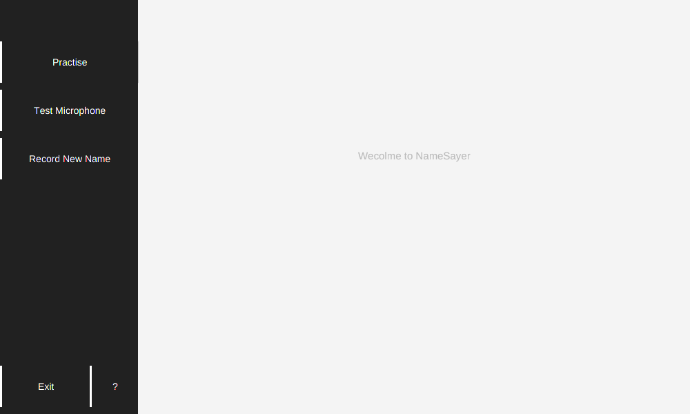
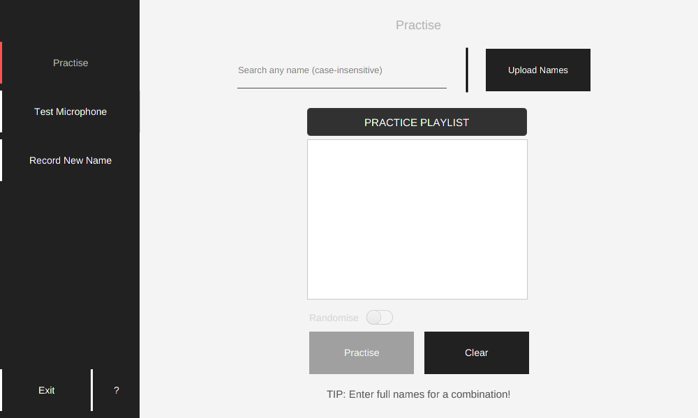
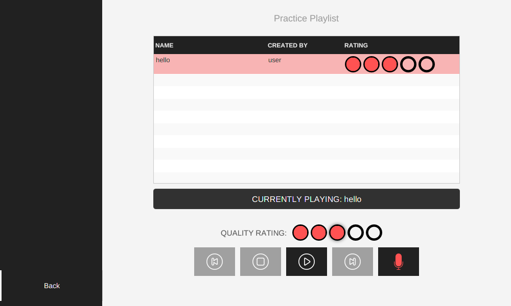
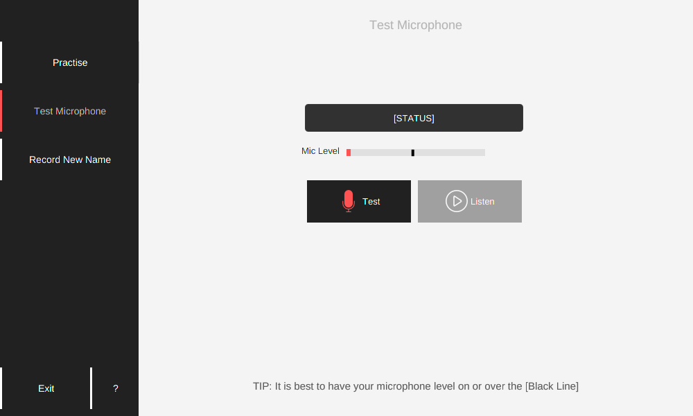
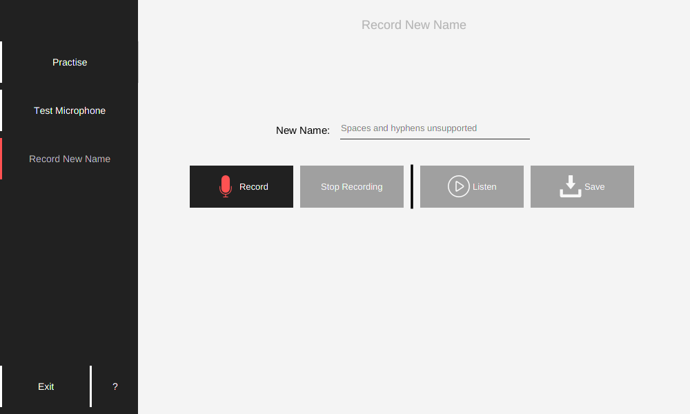

# Project-Namesayer
● Recommended to read README through markdown support  
● Credit: See end of README  

## How to Use

### To Run `Project-NameSayer.jar`
1. Place `Project-NameSayer.jar` into appropriate working folder
2. Extract names database into folder named `data/names` in the same directory as `Project-NameSayer.jar` (default set already there)
3. Onto command line, change directory (`cd`) to appropriate folder
4. Type `java -jar Project-NameSayer.jar`
5. Have fun!

### Screenshots and images

---

### Credit to:
● The​ ​ControlsFX​ ​library​ ​is​ ​licensed​ ​under​ ​the​ ​BSD​ ​3-clause​ ​license  
● The​ ​JFoenix​ ​library​ ​is​ ​licensed​ ​under​ ​the​ ​Apache​ ​License​ ​2.0   
● Music Icons made by Daniele De Santis from: [https://www.flaticon.com/packs/music]  
● Microphone Icon made by Smashicons from: [https://www.flaticon.com/free-icon/microphone_149427#term=record&page=1&position=1]  
● Star Icon made by Dave Gandy from: [https://www.flaticon.com/free-icon/star_25291#term=star&page=1&position=39]  
● Trophy Icons made by Freepik from: [ https://www.flaticon.com/free-icon/award_1170662#term=trophy&page=1&position=28]  
● Clippy Icon from: [http://community.wikia.com/wiki/File:Clippy.png]  
● Repeat Icon made by Smashicons from: [https://www.flaticon.com/free-icon/repeat_149665#term=repeat&page=1&position=6]  
